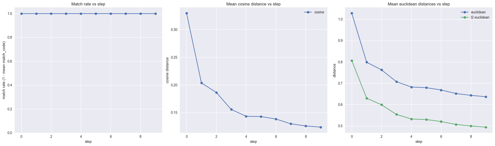
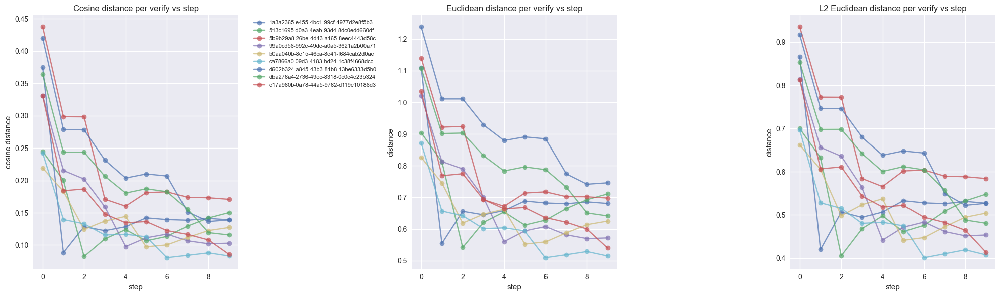
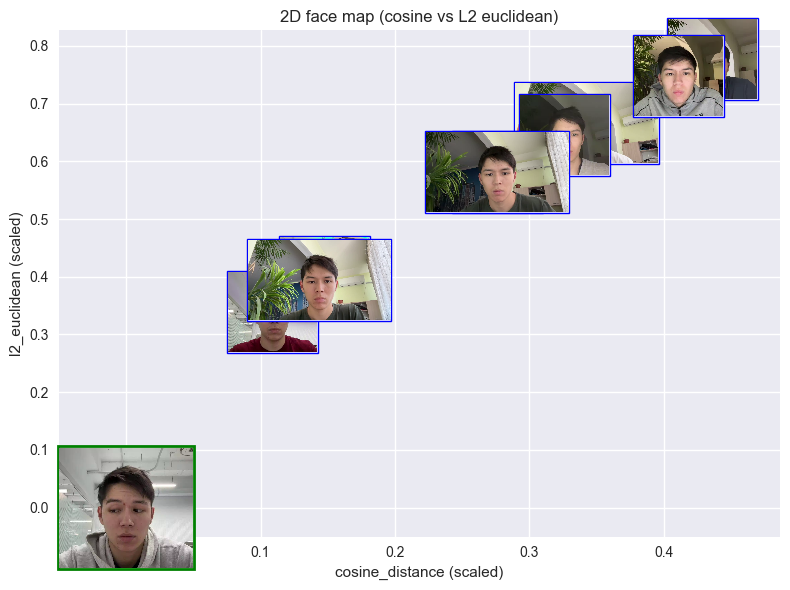

# face-bench

Local benchmarking utilities (batch runs) for the FaceRec pipeline.

This folder is self-contained and uses the copied modules under `ml_models/` and `utils/` plus weights under `model_weights/`.

## What’s here
- Scripts: `scripts/batch_verify_videos.py` (single run), `scripts/continuous_verify.py` (cumulative averaging).
- Analysis: `results_analysis.ipynb` (plots + summaries), `results/` CSVs, `result.csv`.
- Confluence template: `docs/confluence_plan.md` (copy into Confluence with links to repo assets).

## Batch verify (one onboard video vs many verify videos)

From `facerec/face-bench/`:

```bash
python scripts/batch_verify_videos.py \
  --onboard "E:/path/to/onboard.mp4" \
  --verify "E:/path/to/verify_videos/" "E:/path/to/one_more.mp4" \
  --quiet \
  --out_csv "bench_results.csv"
```

Frame selection options:

```bash
# First frame (default)
python scripts/batch_verify_videos.py --onboard onboard.mp4 --verify verify_dir --first_frame

# Center frame
python scripts/batch_verify_videos.py --onboard onboard.mp4 --verify verify_dir --center_frame

# Specific frame index
python scripts/batch_verify_videos.py --onboard onboard.mp4 --verify verify_dir --frame_index 0

# Frame at time (seconds)
python scripts/batch_verify_videos.py --onboard onboard.mp4 --verify verify_dir --time_seconds 1.5
```

### Output

Writes a CSV with distances for each verify video vs the onboarding embedding:
- `cosine_distance` (lower is closer)
- `euclidean` (lower is closer)
- `l2_euclidean` (lower is closer)

It also includes `votes_passed` and `match_code` (aligned with the thresholds embedded in `scripts/batch_verify_videos.py`).

## Continuous verification (cumulative averaged anchor)

This runs multiple steps: start with onboard embedding, then iteratively average in each verify embedding (in order), and at every step compare that averaged anchor against all verify videos. Each step is written to its own CSV.

```bash
python scripts/continuous_verify.py \
  --onboard "E:/path/to/onboard.mp4" \
  --verify "E:/path/to/verify_videos/" \
  --quiet \
  --out_dir "results_continuous"
```

CSV files are named `step_00.csv` (onboard only), `step_01.csv` (onboard + first verify), `step_02.csv`, etc. The columns include `anchor_desc` and `anchor_size` so you know which cumulative anchor was used.

## Analysis notebook
- Open `results_analysis.ipynb` to:
  - Summarize per-step CSVs (match rate, mean distances).
  - Plot per-video trajectories across steps.
  - Plot a 2D face map (cosine vs l2) with thumbnails from `result.csv`.
- Ensure `results/step_*.csv` and `result.csv` exist before running.

### Key plots (exported PNGs)
- Average metrics vs step: `average_output.png`
- Per-file trajectories: `filewise_output.png`
- 2D face map (cosine vs l2 thumbnails): `output.png`

Inline previews (rendered on GitHub):







## Confluence page template
- Use `docs/confluence_plan.md` as the source text; paste into Confluence and attach plots (exported from the notebook) plus link to this repo (`main` branch).

## Quick repo pointers
- Weights: `model_weights/facerec.pth` (and LightCNN/MTCNN weights).
- Data layout (example): `data/onboard/video.mp4`, `data/verify/*.mp4`.
- Outputs: `result.csv` (single), `results/step_*.csv` (continuous), exported plots (add to repo for sharing).


